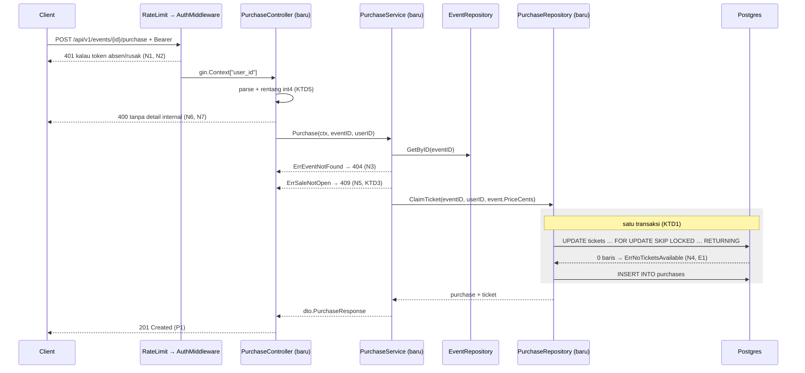
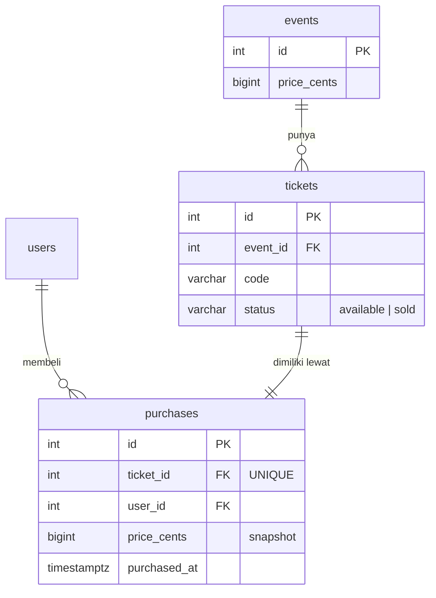
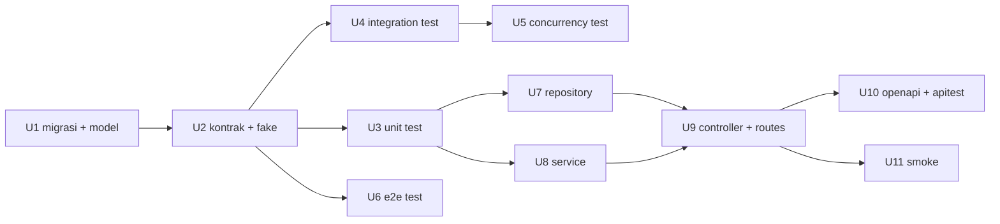

# feat: Pembelian Tiket (Checkout) - Plan

## Goal Capsule

**Tujuan.** Membangun `POST /api/v1/events/{id}/purchase` secara test-first, lengkap dengan
tabel kepemilikan baru, sehingga user terautentikasi bisa membeli satu tiket tanpa pernah
terjadi oversell.

**Otoritas produk.** `docs/brainstorm/2026-09-11-001-feat-ticket-checkout-requirements.md`.
Dokumen ini **tidak menyalin ulang** requirement, perilaku, atau acceptance example dari sana.
Semua rujukan lewat ID (`P1`–`P5`, `N1`–`N7`, `E1`–`E6`, `K1`–`K4`). Kalau plan dan brainstorm
berbeda, brainstorm yang benar; perbaiki plan-nya.

**Product Contract preservation.** Product Contract unchanged. Satu pertanyaan terbuka
(`N5`, status HTTP sebelum masa jual dibuka) ditutup di planning menjadi **409 Conflict** dengan
pesan berbeda dari stok habis — lihat KTD3.

**Branch.** Kerjakan di feature branch, bukan `main` (kendala demo).

---

## Problem Frame

Tidak ada jalur tulis. `tickets` punya satu baris per kursi tetapi tanpa kolom pemilik, dan
`TicketRepository` sengaja hanya punya jalur baca dengan catatan bahwa strategi penguncian
dipilih bersamaan dengan jalur tulis. Plan ini adalah jalur tulis itu: satu endpoint, satu
migrasi, satu repository baru, dan empat lapis pembuktian.

Risiko yang membentuk seluruh rencana ini, berurutan:

1. **Oversell di bawah konkurensi.** Jalur tulis yang salah menjual tiket yang sama dua kali.
   Hanya database sungguhan dan test konkuren yang bisa membuktikan sebaliknya.
2. **Tiket yatim.** `K1` memisahkan kepemilikan ke tabel lain, jadi klaim jadi dua statement.
   Tiket `sold` tanpa baris `purchases` adalah stok hilang permanen yang tidak terlihat oleh
   test mana pun yang cuma melihat `status`.
3. **Kebocoran pesan internal.** Terverifikasi di kode, bukan hipotesis — lihat KTD4.

---

## Key Technical Decisions

### KTD1 — `PurchaseRepository` memiliki transaksi klaim

Repository baru `internal/domain/repositories/purchase_repo.go` mengekspos satu operasi tulis
yang melakukan `UPDATE tickets ... RETURNING` lalu `INSERT INTO purchases` **di dalam satu
transaksi GORM**. Service tidak pernah melihat transaksi.

Dipaksa oleh konvensi repo: hanya lapisan repository yang menyentuh `database.DB`, dan tidak
ada `*gorm.DB` yang di-inject. Menaruh transaksi di service akan menuntut handle database bocor
ke lapisan atas — perubahan arsitektur yang jauh lebih besar dari fitur ini.

`TicketRepository` **tidak diubah**. Menambah method tulis ke sana akan memaksa setiap fake
`MockTicketRepository` yang sudah ada ikut berubah, dan memisah kepemilikan transaksi ke dua
repository.

### KTD2 — Klaim adalah satu `UPDATE` bersyarat, bukan `SELECT` lalu `UPDATE`

Statement pertama memilih dan mengunci sekaligus (`FOR UPDATE SKIP LOCKED` di dalam subquery)
lalu langsung menandai `sold`, dan mengembalikan baris yang menang lewat `RETURNING`. Nol baris
terpengaruh = stok habis. Tidak ada jendela antara "memilih" dan "mengklaim" yang bisa dimasuki
goroutine lain.

Instansiasi `K4` di atas `K1`. Karena kepemilikan ada di tabel terpisah, statement tunggal ini
tetap harus dibungkus transaksi bersama `INSERT` pasangannya (lihat KTD1 dan risiko 2 di atas).

### KTD3 — `ErrSaleNotOpen` menjawab 409, pesan berbeda dari stok habis

Menutup pertanyaan terbuka `N5`. Dua sentinel berbeda (`ErrNoTicketsAvailable`, `ErrSaleNotOpen`)
memetakan ke status yang sama lewat `utils.Conflict` dengan pesan berbeda. Satu kelas masalah
("state event bentrok dengan yang diminta"), satu status code, spec hanya perlu mendaftarkan 409
sekali.

### KTD4 — Controller tidak pernah meneruskan `error` ke helper respons

`utils.HandleErrors` (`pkg/utils/response.go:133`) menyalin `err.Error()` ke field `errors`
respons. Ini bukan risiko teoretis: itulah persis jalur yang membocorkan pesan pgx pada
`GET /api/v1/events/{id}`.

Maka controller checkout memanggil `utils.BadRequest(c, nil, "...")`,
`utils.Conflict(c, nil, "...")`, `utils.InternalServerError(c, nil, "...")` — argumen error
selalu `nil`. Detail masuk `logger.Errorf` di sisi server.

Ini **berbeda** dari `EventController`, yang meneruskan `err`. Perbedaan itu disengaja dan tidak
boleh "dirapikan" menjadi seragam: menyeragamkan ke atas berarti memperbaiki bug yang dilindungi
kendala demo, menyeragamkan ke bawah berarti menambah kebocoran baru.

### KTD5 — Validasi rentang id sebelum menyentuh database

Kolom `events.id` adalah `SERIAL` (`int4`). Controller menolak id `< 1` atau `> 2147483647`
dengan 400 sebelum memanggil service. Error database tidak pernah menjadi jalan keluar.

Hanya berlaku untuk endpoint baru. `EventController.Get` tetap apa adanya (kendala demo).

### KTD6 — Test konkuren hidup di package integration-nya sendiri

`tests/integration/purchases/` adalah package baru dengan `TestMain` sendiri, satu container
untuk seluruh package. Bukan satu container per test.

---

## High-Level Technical Design

Jalur tulis, dari socket sampai disk. Yang ditandai **baru** dibuat oleh plan ini.



Bentuk data setelah migrasi `000007`. `tickets` **tidak bertambah kolom**.



Satu-satunya cara baris `tickets.status` berubah menjadi `sold` adalah lewat
`PurchaseRepository.ClaimTicket`. Tidak ada jalur tulis lain ke `tickets` atau `purchases` di
seluruh aplikasi.

---

## Titik Tulis ke Database

Pertanyaan ini dijawab tunggal supaya tidak ada jalur kedua yang diam-diam tumbuh:

| Tabel | Operasi | Satu-satunya penulis | Dalam transaksi |
|---|---|---|---|
| `tickets` | `available` → `sold` | `PurchaseRepository.ClaimTicket` | ya (KTD1) |
| `purchases` | `INSERT` | `PurchaseRepository.ClaimTicket` | ya, transaksi yang sama |
| `events` | — | tidak ada | — |

`EventRepository` dan `TicketRepository` tetap read-only. Test `E6` adalah yang menjaga janji
ini tetap benar setelah implementasi.

---

## Urutan Kerja dan Paralelisasi

Lima gelombang. Unit dalam satu gelombang menyentuh berkas yang **disjoint** dan aman dijalankan
sebagai task Claude Code paralel. Tidak ada dua unit yang mengedit berkas yang sama.



| Gelombang | Unit | Paralel? |
|---|---|---|
| 1 | U1 | tidak |
| 2 | U2 | tidak |
| 3 | U3, U4, U6 (lalu U5 setelah U4) | ya, 3 task |
| 4 | U7, U8 (lalu U9) | ya, 2 task |
| 5 | U10, U11 | ya, 2 task |

Kepemilikan berkas yang dipakai bersama, satu unit saja yang boleh menyentuhnya:

| Berkas | Pemilik tunggal |
|---|---|
| `tests/integration/harness/harness.go` | U1 |
| `scripts/loadtest/reset.sh` | U1 |
| `tests/integration/purchases/main_test.go` | U4 |
| `tests/e2e/journey_test.go` (termasuk helper seed fixture) | U6 |
| `internal/app/routers/index.go` | U9 |
| `api/openapi.yaml`, `scripts/apitest/run.sh` | U10 |
| `scripts/smoke/main.go` | U11 |

`tests/e2e/main_test.go` **tidak** diubah: fixture disemai dari dalam `journey_test.go`, bukan
lewat hook `harness.RunMain` tambahan, sehingga U6 tetap memiliki satu berkas saja.

Gelombang 3 selesai dengan seluruh suite **merah**, dan itu kondisi yang benar untuk lanjut ke
gelombang 4. Merahnya berupa **assertion yang gagal atau `panic("not implemented")` saat
dijalankan**, bukan build yang pecah: U2 sudah menyediakan setiap deklarasi yang dibutuhkan test,
dan AC2.1 menuntut `go build ./...` bersih. Build yang pecah di akhir gelombang 3 berarti U2
kurang lengkap, bukan TDD yang berjalan benar.

---

## Implementation Units

### U1. Migrasi 000007 + model Purchase + harness

**Goal.** Skema `purchases` ada, terpasang otomatis di container test, dan punya representasi Go.

**Requirements.** `K1`.

**Dependencies.** —

**Files.**
- `internal/adapters/database/migrations/sql/000007_create_purchases_table.up.sql` (baru)
- `internal/adapters/database/migrations/sql/000007_create_purchases_table.down.sql` (baru)
- `internal/domain/models/purchase_model.go` (baru)
- `tests/integration/harness/harness.go` (ubah: daftar truncate + batas pool)
- `scripts/loadtest/reset.sh` (ubah: nama tabel)

**Approach.**
1. Tulis pasangan migrasi. `up.sql` membuat tabel sesuai bentuk di `K1`: `ticket_id` `NOT NULL
   UNIQUE REFERENCES tickets (id)`, `user_id` `NOT NULL REFERENCES users (id)`, `price_cents`
   `BIGINT NOT NULL CHECK (price_cents >= 0)`, `purchased_at` `TIMESTAMPTZ NOT NULL DEFAULT NOW()`.
   Tambahkan `COMMENT` mengikuti gaya `000005`/`000006`.
2. `down.sql` berisi `DROP TABLE IF EXISTS purchases;` dan tidak lebih. Tidak ada kolom yang
   ditambahkan ke `tickets`, jadi tidak ada yang perlu dibatalkan di sana (asumsi 2 origin).
3. Model GORM mencocokkan DDL dengan tangan — tidak ada AutoMigrate. `PriceCents` wajib `int64`.
   Sertakan `TableName()`.
4. Tambahkan `"purchases"` ke daftar tabel di `harness.Reset`. Urutan tidak berpengaruh hari ini —
   loop-nya memakai `TRUNCATE ... RESTART IDENTITY CASCADE` per tabel, jadi men-truncate `tickets`
   sudah ikut membersihkan `purchases`. Didaftarkan eksplisit supaya reset tetap benar pada hari
   foreign key ke `tickets` dilepas.
5. Batasi pool koneksi di `harness.RunMain`, setelah `database.DbConnection` berhasil: ambil
   `database.GetDB().DB()` lalu `SetMaxOpenConns(50)` dan `SetMaxIdleConns(10)`. Repo ini tidak
   pernah membatasi pool (`internal/adapters/database/database.go` tidak memanggil
   `SetMaxOpenConns`), sedangkan `postgres:16-alpine` memakai `max_connections=100` bawaan. Tanpa
   batas ini, test konkuren U5 mati dengan `FATAL: sorry, too many clients already` — kegagalan
   yang terbaca seperti bug pada jalur klaim padahal bukan.
6. **`scripts/loadtest/reset.sh` menebak nama tabel yang salah.** Blok `DO`-nya menjaga
   `to_regclass('public.orders')` dan men-truncate `orders` — nama yang ditulis sebelum checkout
   dirancang, sementara `K1` menamainya `purchases`. Ganti keduanya ke `purchases`. Tanpa ini
   `make loadtest` kedua dan seterusnya melaporkan nol terjual, bukan nol oversell: tiket
   dikembalikan ke `available` tetapi baris `purchases` tertinggal, lalu `ticket_id UNIQUE`
   menolak setiap klaim ulang.

**Patterns to follow.** `000006_create_tickets_table.up.sql` untuk gaya SQL dan komentar;
`internal/domain/models/ticket_model.go` untuk bentuk struct dan `TableName()`.

**Acceptance criteria.**

| # | Kondisi terukur | Dibuktikan oleh |
|---|---|---|
| AC1.1 | `migrate up` lalu `migrate down` satu langkah kembali ke skema 000006 tanpa error | dijalankan manual; harness gagal keras kalau `up` rusak |
| AC1.2 | Container harness membawa tabel `purchases` | setiap test di U4 (harness gagal saat migrasi kalau tidak) |
| AC1.3 | `harness.Reset` mengosongkan `purchases` | `TestPurchaseService_Purchase/positive/...` bersih antar sub-test di U4 |
| AC1.4 | Tag GORM cocok dengan DDL, `PriceCents` `int64` | `TestPurchaseService_Purchase/edge_case/price_cents_...` di U4 |
| AC1.5 | Test konkuren tidak pernah menghasilkan error koneksi | `..._Concurrent/...` di U5 mencatat nol `too many clients` |
| AC1.6 | Dua `make loadtest` berturut-turut masing-masing melaporkan 100 terjual | dijalankan dua kali; run kedua bukan "BELUM ADA YANG TERJUAL" |

**Test scenarios.** Test expectation: none pada unit ini sendiri — skema dan model tidak punya
perilaku. Pembuktiannya dititipkan ke U4 yang memakai keduanya terhadap Postgres sungguhan.

**Verification.** `go build ./...` bersih; `go test ./tests/integration/events/...` masih hijau,
membuktikan migrasi baru tidak merusak yang lama.

---

### U2. Kontrak: interface, DTO, sentinel, fake

**Goal.** Semua deklarasi yang dibutuhkan test agar bisa dikompilasi, tanpa satu pun perilaku.

**Requirements.** `K1`, `K3`, KTD1, KTD3.

**Dependencies.** U1.

**Files.**
- `internal/domain/repositories/purchase_repo.go` (baru — **hanya interface dan konstruktor**)
- `internal/app/dto/purchase_dto.go` (baru)
- `internal/app/services/purchase_service.go` (baru — **hanya sentinel, struct, konstruktor**)
- `tests/mocks/purchase_repo_mock.go` (baru)

**Approach.**
1. `PurchaseRepository` mengekspos satu operasi klaim yang menerima event id, user id, dan harga
   snapshot, lalu mengembalikan hasil klaim atau penanda "tidak ada stok". **Bentuk penandanya
   diputuskan di sini, bukan di U7**: sentinel repository `ErrNoAvailableTicket`. U3 harus
   menyetel fake supaya melapor kehabisan stok, dan fake itu lahir di unit ini — menunda
   keputusan ke U7 membuat gelombang 3 mandek.
2. `dto.PurchaseResponse` sesuai tabel Kontrak API di origin. `PriceCents` `int64`. **Tidak ada
   `user_id`** di respons.
3. Sentinel `ErrNoTicketsAvailable` dan `ErrSaleNotOpen` di `services`, sejajar
   `ErrEventNotFound` yang sudah ada.
4. `MockPurchaseRepository` in-memory dengan `var _ repositories.PurchaseRepository =
   (*MockPurchaseRepository)(nil)`, field error yang bisa disetel (`ClaimErr`), flag `NoStock bool`
   yang membuatnya mengembalikan `ErrNoAvailableTicket`, dan helper seed sejajar
   `MockTicketRepository.SeedAvailable`.
5. Method body di repository dan service boleh `panic("not implemented")` atau return zero —
   yang penting **tidak ada** yang membuat test hijau secara tidak sengaja.

**Patterns to follow.** `internal/domain/repositories/ticket_repo.go` (interface + impl tak
diekspor + `New*`); `tests/mocks/ticket_repo_mock.go` (assertion waktu-kompilasi, mutex, Seed).

**Acceptance criteria.**

| # | Kondisi terukur | Dibuktikan oleh |
|---|---|---|
| AC2.1 | `go build ./...` bersih | build |
| AC2.2 | Assertion waktu-kompilasi ada dan mengikat | build gagal kalau interface berubah tanpa fake ikut |
| AC2.3 | Tidak ada method yang mengembalikan hasil sukses palsu | U3 merah saat dijalankan, bukan hijau |

**Test scenarios.** Test expectation: none — unit ini murni deklarasi. Perilakunya diuji U3.

**Verification.** `go vet ./...` bersih dan `go test ./tests/...` masih hijau (belum ada test baru).

---

### U3. Test unit PurchaseService

**Goal.** Mengunci perilaku service terhadap fake, tanpa database.

**Requirements.** `P1`, `P4`, `P5`, `N3`, `N4`, `N5`, `E1`, `E4`, `K2`, `K3`.

**Dependencies.** U2.

**Files.** `tests/unit/services/purchase_service_test.go` (baru)

**Approach.** Package `services_test`, black box. Hanya `MockEventRepository` dan
`MockPurchaseRepository`. Tidak ada `database.DB`. Satu `TestPurchaseService_Purchase` dengan
tiga cabang `t.Run`: `positive`, `negative`, `edge case`.

**Execution note.** Tulis seluruh berkas ini sebelum U7/U8 punya isi. Jalankan sekali dan pastikan
merah; kalau ada yang hijau, test itu tidak menguji apa pun.

**Patterns to follow.** `tests/unit/services/event_service_test.go` untuk gaya; cabang
`positive`/`negative`/`edge case` dari `tests/integration/events/event_flow_test.go`.

**Test scenarios.**

`TestPurchaseService_Purchase/positive/`
- `mengembalikan tiket yang diklaim beserta id purchase` — event dengan stok, satu panggilan → response berisi `ticket_id`, `ticket_code`, `id` bukan nol. (`P1`)
- `menyalin harga event ke dalam purchase` — event `price_cents` 15000000 → response `price_cents` 15000000, dan nilai yang diterima fake repository sama persis. (`P5`)
- `dua pembelian user yang sama menghasilkan tiket berbeda` — dua panggilan berurutan user id sama → dua `ticket_id` berbeda, tidak ada penolakan. (`P4`, `K2`)

`TestPurchaseService_Purchase/negative/`
- `event tidak dikenal mengembalikan ErrEventNotFound` — id yang tidak diseed → `errors.Is` cocok, response nil. (`N3`)
- `stok habis mengembalikan ErrNoTicketsAvailable` — fake melapor tidak ada stok → sentinel cocok. (`N4`, `E1`)
- `masa jual belum dibuka mengembalikan ErrSaleNotOpen` — `SaleStartsAt` satu jam ke depan → sentinel cocok, dan repository klaim **tidak pernah dipanggil**. (`N5`, KTD3)
- `kegagalan repository event dibungkus, bukan ditelan` — `GetErr` disetel → error non-nil dan bukan `ErrEventNotFound`. (jalur error)
- `kegagalan repository purchase dibungkus, bukan ditelan` — `ClaimErr` disetel → error non-nil dan bukan `ErrNoTicketsAvailable`. (jalur error)

`TestPurchaseService_Purchase/edge_case/`
- `price_cents 9007199254740993 melewati service tanpa berubah` — di atas batas integer eksak `float64`; konversi float di titik mana pun membuatnya merah. (`E4`)
- `price_cents nol diterima` — batas bawah `CHECK (price_cents >= 0)`, bukan kasus error.
- `masa jual dibuka satu detik lalu diterima` — `SaleStartsAt: now.Add(-time.Second)` → bukan penolakan.
- `masa jual dibuka satu detik lagi ditolak` — `SaleStartsAt: now.Add(time.Second)` → `ErrSaleNotOpen`.

Dua skenario terakhir memakai offset ±1 detik, **bukan** `SaleStartsAt` sama persis dengan
`time.Now()`. Service membaca jamnya sendiri, jadi nilai "tepat sekarang" sudah lewat saat
dibandingkan dan test-nya hijau baik implementasinya inklusif maupun eksklusif — persis regresi
yang seharusnya ia tangkap. Inklusivitas pada titik yang sama persis tidak bisa diamati tanpa
menyuntikkan jam ke service, dan itu di luar ruang lingkup. Offset ±1 detik mengikuti pola batas
yang sudah dipakai `tests/unit/services/event_service_test.go`.

**Acceptance criteria.** Setiap skenario di atas adalah satu acceptance criterion. Unit selesai
ketika ke-12-nya ada, merah sebelum U7/U8, dan hijau sesudahnya — tanpa satu pun diubah isinya
agar cocok dengan implementasi.

**Verification.** `go test ./tests/unit/services/ -run TestPurchaseService -v` menampilkan 12 leaf
test di bawah tiga cabang.

---

### U4. Test integration jalur penuh

**Goal.** Membuktikan service, repository, dan Postgres sungguhan sepakat.

**Requirements.** `P1`, `P2`, `P3`, `P5`, `N3`, `N4`, `N5`, `E1`, `E4`, `E5`, `E6`, `K1`, `K4`.

**Dependencies.** U2.

**Files.**
- `tests/integration/purchases/main_test.go` (baru)
- `tests/integration/purchases/purchase_flow_test.go` (baru)

**Approach.**
1. `main_test.go` berisi `func TestMain(m *testing.M) { os.Exit(harness.RunMain(m)) }` dan tidak
   lebih. Satu container untuk seluruh package (KTD6).
2. Helper seed lokal mengikuti `seedEvent` di package events: event + n tiket available, plus
   satu user sungguhan (kepemilikan butuh `user_id` yang lolos foreign key).
3. Setiap sub-test mulai dengan `harness.Reset(t)`.
4. Tidak ada env var, tidak ada `t.Skip`, tidak ada DSN. Pihak ketiga tidak ada di jalur ini,
   jadi tidak ada yang di-mock.

**Execution note.** Tulis sebelum U7/U8. Merah di sini berarti gagal kompilasi dulu, lalu gagal
assertion setelah U7/U8 ada — keduanya sinyal yang benar.

**Patterns to follow.** `tests/integration/events/main_test.go` dan `event_flow_test.go` persis.

**Test scenarios.**

`TestPurchaseService_Purchase/positive/`
- `jalur penuh menulis satu baris purchases dan menandai tiketnya sold` — verifikasi langsung ke database, bukan hanya lewat response. (`P1`, `K1`)
- `available_tickets turun tepat satu` — baca ulang lewat `EventService.Get`. (`P2`)
- `mengklaim tiket available dengan id terkecil` — seed 5 tiket, **tandai sold tiket ber-id terkecil lebih dulu**, lalu beli dan assert yang diklaim adalah id terkecil di antara yang masih available. Tanpa langkah itu, sequential scan atas 5 baris yang disisipkan berurutan mengembalikan id terkecil bahkan tanpa `ORDER BY id`, sehingga skenarionya nyaris tidak bisa gagal. (`P3`, `K4`)
- `harga di purchases sama dengan harga event saat pembelian` — (`P5`)
- `user yang sama membeli dua kali berturut-turut mendapat dua tiket berbeda` — dua klaim berurutan oleh satu user terhadap event 5 tiket; assert dua `ticket_id` berbeda dan dua baris `purchases`. Ini yang membuktikan `K2` terhadap skema sungguhan: klaim `K2` adalah *ketiadaan* constraint, dan hanya database yang bisa menyangkalnya kalau migrasi diam-diam mendapat `UNIQUE (event_id, user_id)`. (`P4`, `K2`)

`TestPurchaseService_Purchase/negative/`
- `event tidak dikenal mengembalikan ErrEventNotFound` — (`N3`)
- `event yang seluruh tiketnya sold mengembalikan ErrNoTicketsAvailable` — (`N4`)
- `event tanpa tiket available sejak awal mengembalikan ErrNoTicketsAvailable pada request pertama` — (`E1`)
- `masa jual belum dibuka mengembalikan ErrSaleNotOpen` — (`N5`)
- `database menolak baris purchases kedua untuk ticket_id yang sama` — `INSERT` langsung, assert pelanggaran unique. Constraint yang diuji, bukan kode. (`K1`)
- `INSERT purchases yang gagal mengembalikan tiket ke available` — **skenario yang membuat KTD1 bisa gagal.** Siapkan kondisi yang membuat statement kedua gagal setelah statement pertama sukses: sisipkan lebih dulu satu baris `purchases` untuk tiket ber-id terkecil sehingga klaim berikutnya menabrak `ticket_id UNIQUE` (alternatif: `user_id` yang melanggar foreign key). Lalu assert tiket itu **masih** `available` dan `COUNT(*) FROM purchases` tidak berubah. (KTD1)

`TestPurchaseService_Purchase/edge_case/`
- `price_cents 9007199254740993 bertahan utuh melewati round trip database` — tulis, baca ulang dari `purchases`, bandingkan sebagai `int64`. (`E4`)
- `mengubah harga event setelah pembelian tidak mengubah baris purchases` — snapshot, bukan referensi. (`E5`)
- `tidak ada tiket sold tanpa baris purchases pasangannya` — query `LEFT JOIN` setelah serangkaian pembelian, assert nol yatim. (`E6`)

**Acceptance criteria.** Ke-14 skenario ada dan hijau setelah U7. Skenario
`INSERT purchases yang gagal mengembalikan tiket ke available` **tidak boleh dilewati**: ia
satu-satunya yang bisa gagal kalau implementasinya tidak transaksional. `E6` sendiri tidak cukup —
`LEFT JOIN` di jalur bahagia menemukan nol yatim baik ada transaksi maupun tidak.

**Verification.** `go test ./tests/integration/purchases/ -v` hijau, satu container saja yang
muncul di `docker ps` selama run.

---

### U5. Test integration konkuren

**Goal.** Membuktikan tidak ada oversell dan tidak ada tiket terjual dua kali di bawah beban.

**Requirements.** `E2`, `E3`, `E6`, `K4`.

**Dependencies.** U4 (memakai `TestMain` dan helper seed dari package yang sama).

**Files.** `tests/integration/purchases/purchase_concurrency_test.go` (baru)

**Approach.**
1. Seed satu event dengan 100 tiket **dan satu user sungguhan** — `purchases.user_id` punya
   foreign key ke `users`, dan `harness.Reset` mengosongkan tabel itu.
2. Terbitkan 200 percobaan pembelian, tetapi batasi yang in-flight dengan semaphore buffered
   berkapasitas 50, mengikuti pola `sem := make(chan struct{}, cfg.concurrency)` di
   `scripts/loadtest/main.go:179`. Channel start menyinkronkan gelombang pertama; ia tidak
   melepas 200 transaksi sekaligus. Batas ini berpasangan dengan `SetMaxOpenConns(50)` di U1 —
   tanpa keduanya test mati dengan `too many clients already`, bukan dengan assertion-nya.
3. Kumpulkan hasil per goroutine, hitung sukses dan `ErrNoTicketsAvailable`.
4. Assert dari **database**, bukan dari hitungan di memori: `COUNT(*) FROM purchases`,
   `COUNT(DISTINCT ticket_id)`, dan jumlah tiket `sold`.
5. Catat durasi wall-clock seluruh run dan nyatakan orde besaran yang diharapkan.

**Execution note.** Wajib lulus di bawah `-race`. Unit ini membuktikan **kebenaran** — nol
oversell, nol tiket ganda, nol yatim — dan tidak lebih. Ia **tidak** membuktikan `SKIP LOCKED`
yang dipakai: keempat assertion-nya dipenuhi sama persis oleh serialisasi apa pun yang benar,
termasuk mutex Go atau `FOR UPDATE` pada baris event. Itulah gunanya langkah 5: peralihan diam-diam
ke penguncian yang mengantre muncul sebagai regresi waktu, bukan lolos tanpa terlihat. Ini logika
yang sama dengan keberadaan `scripts/nplusone` — hasil yang benar tapi mahal lolos seluruh suite.

**Test scenarios.**

`TestPurchaseService_Purchase_Concurrent/edge_case/`
- `200 percobaan terhadap 100 tiket menjual tepat 100` — 100 sukses, 100 `ErrNoTicketsAvailable`, nol error lain, khususnya nol error koneksi. (`E2`)
- `tidak ada tiket yang terjual dua kali` — `COUNT(DISTINCT ticket_id)` di `purchases` sama dengan `COUNT(*)`. (`E2`, `E6`)
- `jumlah tiket sold sama dengan jumlah baris purchases` — tidak ada tiket yatim meski di bawah konkurensi. (`E6`)
- `dua pembelian berbarengan oleh user yang sama menghasilkan tiket berbeda` — 2 goroutine, user id sama. (`E3`)

**Acceptance criteria.** Keempat assertion di atas hijau pada `go test ./tests/integration/purchases/
-race -count=3`. Dijalankan tiga kali karena race yang hanya kadang muncul tidak dianggap lulus.

**Verification.** `-race` bersih, tanpa peringatan data race.

---

### U6. Test E2E perjalanan checkout

**Goal.** Membuktikan route terdaftar, guard terpasang di grup yang benar, dan JSON di kawat benar.

**Requirements.** `P1`, `P2`, `N1`, `N2`, `N3`, `N4`, `N5`, `N6`, `N7`, KTD4, KTD5.

**Dependencies.** U2.

**Files.** `tests/e2e/journey_test.go` (ubah — tambah, jangan tulis ulang)

**Approach.**

0. **Seed fixture-nya lebih dulu.** Container e2e dimigrasi tapi **tidak pernah di-seed**:
   `harness.RunMain` hanya menjalankan migrasi, `startServer` hanya memanggil `metrics.Init()` dan
   `routers.SetupRoute()`, dan seeder dev hanya jalan dari `main.go` saat `APP_ENV=development`
   (harness tidak menyetelnya). Jadi `GET /api/v1/events` menjawab daftar kosong dan tidak ada
   event untuk dibeli — tidak ada pula endpoint yang bisa membuatnya. Tambahkan helper
   `seedEventWithTickets(t, n)` di `tests/e2e/journey_test.go` yang menyisipkan event plus n tiket
   available langsung lewat `database.DB`: satu event berstok penuh untuk perjalanan bahagia, satu
   event 2 tiket untuk kasus stok habis, satu event dengan `sale_starts_at` di masa depan untuk
   `N5`. Test e2e yang ada hari ini lolos hanya karena mendekode daftar kosong tanpa memeriksanya.
   **Ini satu-satunya tempat E2E menyentuh database langsung.** Aturan "tidak memanggil service
   atau repository" berlaku pada jalur permintaan dan assertion, bukan pada penyiapan fixture —
   fixture ditulis lewat `database.DB`, bukan lewat service atau repository.
1. Perjalanan baru `TestJourney_VisitorBuysATicket`: register → login → `GET /api/v1/events`
   (ambil event yang punya stok) → `POST /api/v1/events/{id}/purchase` → baca ulang
   `GET /api/v1/events/{id}` dan pastikan `available_tickets` berkurang satu. Semua permintaan dan
   assertion lewat helper `call` yang sudah ada.
2. Tambah **dua** baris ke tabel kasus `TestJourney_GuardRejectsUnauthenticated` yang sudah ada:
   `POST /api/v1/events/1/purchase` tanpa token → 401 (`N1`), dan dengan token sampah
   (`"not-a-jwt"`) → 401 (`N2`). Kasus token rusak yang ada sekarang semuanya menembak
   `/api/v1/profile`, jadi tanpa baris kedua separuh `N2` tidak tersentuh pada route baru.
3. Perjalanan penolakan `TestJourney_PurchaseRejections` dengan token valid.
4. Struct `purchase` lokal untuk mendekode `data`, sejajar struct `event` yang sudah ada.
5. `tests/e2e` tidak pernah memanggil `harness.Reset`, jadi fixture bertahan sepanjang package.
   Beri tiap perjalanan event-nya sendiri supaya urutan test tidak menjadi penentu hasil.

**Execution note.** Router wajib datang dari `routers.SetupRoute()` lewat `startServer` yang sudah
ada di `main_test.go`. Jangan merakit router di dalam test — test yang mendaftarkan route-nya
sendiri tidak membuktikan apa pun tentang route yang didaftarkan aplikasi.

**Patterns to follow.** `tests/e2e/journey_test.go` apa adanya: helper `call`, `decode`,
`uniqueEmail`, dan tabel kasus untuk yang negatif.

**Test scenarios.**

`TestJourney_VisitorBuysATicket`
- Alur penuh sampai `available_tickets` berkurang satu, dan `data` membawa `ticket_code` tidak kosong serta `price_cents` sebagai angka JSON, bukan string. (`P1`, `P2`)

`TestJourney_GuardRejectsUnauthenticated` (tambahan kasus)
- `beli tanpa token` → 401, `success=false`. (`N1`)
- `beli dengan token sampah` → 401. (`N2`)

`TestJourney_PurchaseRejections/negative/`
- `event tidak ada menjawab 404` — id yang pasti tidak ada. (`N3`)
- `stok habis menjawab 409` — habiskan stok event 2 tiket lewat HTTP berulang, lalu satu request lagi. (`N4`)
- `masa jual belum dibuka menjawab 409 dengan pesan berbeda dari stok habis` — event ber-`sale_starts_at` di masa depan. Tanpa skenario ini, controller yang memetakan `ErrSaleNotOpen` ke 500 atau memakai pesan yang sama untuk kedua sebab tetap hijau, dan KTD3 tidak terkunci oleh apa pun. (`N5`, KTD3)
- `id bukan angka menjawab 400` — `/events/abc/purchase`. (`N6`)
- `id di luar jangkauan int4 menjawab 400` — `/events/99999999999999/purchase`, bukan 500. (`N7`, KTD5)
- `respons gagal tidak membawa detail internal` — badan respons untuk **setiap** kasus gagal di atas **dan** untuk kedua kasus 401 di `TestJourney_GuardRejectsUnauthenticated` tidak mengandung `pgx`, `int4`, `OID`, `SQL`, atau `sql:`. (KTD4)

**Acceptance criteria.** Keenam penolakan hijau, dan pemeriksaan kebocoran dijalankan terhadap
**setiap** respons gagal, bukan satu contoh saja.

**Catatan yang diperkirakan merah dan memang harus begitu.** Pemeriksaan kebocoran pada kedua
respons 401 akan gagal pada run pertama: `AuthMiddleware` meneruskan `err` ke
`utils.Unauthorized` (`internal/app/middlewares/auth.go:43`), jadi badan 401 membawa teks pustaka
JWT ("token is malformed: ...", "token has invalid claims: token is expired"). KTD4 hanya
mendisiplinkan controller, dan middleware bukan milik story ini. Batasi assertion kebocoran 401
pada penanda database (`pgx`, `int4`, `OID`, `SQL`, `sql:`) yang memang tidak boleh ada di sana,
dan catat teks JWT-nya sebagai utang di Deferred to Follow-Up Work — jangan memperbaiki middleware
di story ini.

**Verification.** `go test ./tests/e2e/ -v`; seluruh test E2E lama tetap hijau.

---

### U7. Implementasi PurchaseRepository

**Goal.** Klaim transaksional yang tidak bisa oversell.

**Requirements.** `P1`, `P3`, `P5`, `N4`, `E1`, `E2`, `E3`, `E4`, `E5`, `E6`, `K1`, `K4`, KTD1,
KTD2. (Union penuh dari Requirements Trace — unit ini dikerjakan sebagai task terisolasi, jadi
daftar di sini adalah satu-satunya ruang lingkup yang dilihat pengerjanya.)

**Dependencies.** U3 (test merah lebih dulu).

**Files.** `internal/domain/repositories/purchase_repo.go` (isi method)

**Approach.**
1. Bungkus keduanya dalam satu transaksi GORM.
2. Statement klaim: `UPDATE tickets SET status='sold' WHERE id = (SELECT id FROM tickets WHERE
   event_id = ? AND status = 'available' ORDER BY id LIMIT 1 FOR UPDATE SKIP LOCKED) RETURNING
   id, code`. Nol baris = stok habis; kembalikan penanda, bukan error database.
3. `INSERT INTO purchases` dengan `ticket_id` hasil `RETURNING`, `user_id`, dan `price_cents`
   yang diterima dari service. `purchased_at` dibiarkan `DEFAULT NOW()` (asumsi 1 origin).
4. Kegagalan apa pun membatalkan transaksi; tiket kembali `available` karena belum commit.
5. Repository tidak melakukan tracing (konvensi repo) dan tidak memutuskan status HTTP.

**Patterns to follow.** `ticket_repo.go` untuk bentuk, penanganan error, dan `logger.Errorf`.

**Acceptance criteria.**

| # | Kondisi terukur | Dibuktikan oleh |
|---|---|---|
| AC7.1 | **Statement kedua gagal → statement pertama dibatalkan** (transaksi nyata) | `.../negative/INSERT_purchases_yang_gagal_mengembalikan_tiket_ke_available` (U4) |
| AC7.2 | Tidak ada tiket `sold` tanpa baris `purchases` di jalur bahagia | `.../edge_case/tidak_ada_tiket_sold_tanpa_baris_purchases` (U4) |
| AC7.3 | Nol oversell pada 200 percobaan paralel | `..._Concurrent/edge_case/200_percobaan...` (U5) |
| AC7.4 | Tidak ada tiket terjual dua kali | `..._Concurrent/edge_case/tidak_ada_tiket_yang_terjual_dua_kali` (U5) |
| AC7.5 | Stok habis dilaporkan sebagai kondisi, bukan error database | `.../negative/event_yang_seluruh_tiketnya_sold...` (U4) |
| AC7.6 | Harga tersimpan sebagai `int64` tanpa kehilangan presisi | `.../edge_case/price_cents_9007199254740993...` (U4) |
| AC7.7 | Satu user bisa memegang dua tiket berbeda pada satu event | `.../positive/user_yang_sama_membeli_dua_kali...` (U4) |

AC7.1 dan AC7.2 sengaja dipisah. AC7.2 sendiri **tidak bisa gagal** pada implementasi yang tidak
transaksional — `UPDATE` lalu `INSERT` tanpa transaksi tetap menghasilkan nol yatim selama
keduanya sukses. Hanya AC7.1 yang memaksa statement kedua gagal dan menuntut statement pertama
dibatalkan, jadi AC7.1 adalah satu-satunya bukti KTD1.

**Verification.** U4 dan U5 hijau, `-race` bersih.

---

### U8. Implementasi PurchaseService

**Goal.** Aturan domain dan pemetaan ke sentinel, tanpa satu pun keputusan HTTP.

**Requirements.** `P1`, `P4`, `P5`, `N3`, `N4`, `N5`, `E4`, `K2`, `K3`, KTD3. (Union penuh dari
Requirements Trace.)

**Dependencies.** U3. Paralel dengan U7 — keduanya hanya bergantung pada interface dari U2.

**Files.** `internal/app/services/purchase_service.go` (isi method)

**Approach.**
1. Ambil event lewat `EventRepository.GetByID`; `nil` → `ErrEventNotFound`.
2. Tolak dengan `ErrSaleNotOpen` kalau `SaleStartsAt` masih di depan. Batasnya inklusif, sejajar
   `SaleOpen` di `EventService.buildResponse`. Cek ini terjadi **sebelum** klaim, sehingga tidak
   ada tiket yang terkunci sia-sia.
3. Serahkan `event.PriceCents` ke repository sebagai snapshot (`P5`).
4. Petakan "tidak ada stok" dari repository ke `ErrNoTicketsAvailable`.
5. Rakit `dto.PurchaseResponse`. Tanpa `user_id`.
6. `logger.LogStart` / `LogFinish` dengan span `PurchaseService.Purchase`, `LogFinish` sebelum
   **setiap** return.

**Patterns to follow.** `event_service.go`: sentinel di level package, tracing, `fmt.Errorf` dengan
`%w`.

**Acceptance criteria.**

| # | Kondisi terukur | Dibuktikan oleh |
|---|---|---|
| AC8.1 | Event tidak ada → `ErrEventNotFound` | `.../negative/event_tidak_dikenal...` (U3, U4) |
| AC8.2 | Sebelum masa jual → `ErrSaleNotOpen`, repository tidak dipanggil | `.../negative/masa_jual_belum_dibuka...` (U3) |
| AC8.3 | Stok habis → `ErrNoTicketsAvailable` | `.../negative/stok_habis...` (U3, U4) |
| AC8.4 | Harga yang diteruskan adalah harga event saat itu | `.../positive/menyalin_harga_event...` (U3) |
| AC8.5 | Tidak ada `int`, `float64`, atau string di jalur uang | `.../edge_case/price_cents_9007199254740993...` (U3) |
| AC8.6 | Service tidak pernah menyebut status HTTP | grep: tidak ada `net/http` atau `utils` di berkas ini |

**Verification.** U3 hijau seluruhnya.

---

### U9. Controller, routes, dan wiring

**Goal.** Endpoint terdaftar di belakang `AuthMiddleware` dan menjawab dengan status yang benar.

**Requirements.** `P1`, `P2`, `N1`, `N2`, `N3`, `N4`, `N5`, `N6`, `N7`, `K3`, KTD3, KTD4, KTD5.
(Union penuh dari Requirements Trace.)

**Dependencies.** U7, U8.

**Files.**
- `internal/app/controllers/purchase_controller.go` (baru)
- `internal/app/routers/purchase_routes.go` (baru)
- `internal/app/routers/index.go` (ubah — satu-satunya tempat wiring)

**Approach.**
1. Controller mengambil `user_id` dari `gin.Context` — **tidak pernah** dari body, query, atau
   header lain. Ini yang menutup IDOR pada endpoint ini.
2. Parse `id` lalu tolak `< 1` atau `> 2147483647` dengan 400, sebelum menyentuh service (KTD5).
3. Petakan sentinel dengan `errors.Is`: `ErrEventNotFound` → 404; `ErrNoTicketsAvailable` dan
   `ErrSaleNotOpen` → 409 dengan pesan berbeda; sisanya → 500.
4. **Setiap** panggilan `utils.*` memakai `nil` untuk argumen error (KTD4). Detail ke
   `logger.Errorf`/`Warnf`.
5. Sukses: `utils.Created`, 201.
6. `RegisterPurchaseRoutes` menerima grup yang **sudah** memakai `AuthMiddleware`. Di `index.go`,
   daftarkan di dalam blok `protectedRoutes` yang sudah ada, bukan di `apiV1` telanjang.
7. Route-nya `group.POST("/events/:id/purchase", ...)`. Wildcard-nya **wajib** bernama `:id`,
   sama dengan `/events/:id` yang sudah didaftarkan `RegisterEventRoutes`. Nama lain yang lebih
   deskriptif seperti `:eventID` membuat Gin panic saat engine dibangun
   (`gin@v1.12.0/tree.go:230`, "conflicts with existing wildcard"), yang menjatuhkan seluruh test
   e2e dan `make run` sekaligus. KTD5 dan path di openapi juga mengasumsikan `id`.
8. Tracing `PurchaseController.Purchase`.

**Patterns to follow.** `event_controller.go` untuk bentuk dan pemetaan `errors.Is` — tapi
**tidak** untuk penanganan argumen error, lihat KTD4. `event_routes.go` untuk bentuk
`Register*Routes`.

**Acceptance criteria.**

| # | Kondisi terukur | Dibuktikan oleh |
|---|---|---|
| AC9.1 | Tanpa token → 401 | `TestJourney_GuardRejectsUnauthenticated/beli_tanpa_token` (U6) |
| AC9.2 | Sukses → 201 dengan envelope standar | `TestJourney_VisitorBuysATicket` (U6) |
| AC9.3 | Event tidak ada → 404 | `TestJourney_PurchaseRejections/negative/event_tidak_ada...` (U6) |
| AC9.4 | Stok habis → 409 | `.../stok_habis_menjawab_409` (U6) |
| AC9.5 | Id non-numerik → 400 | `.../id_bukan_angka...` (U6) |
| AC9.6 | Id di luar `int4` → 400, bukan 500 | `.../id_di_luar_jangkauan_int4...` (U6) |
| AC9.7 | Tidak ada respons gagal yang membawa teks driver | `.../respons_gagal_tidak_membawa_detail_internal` (U6) |
| AC9.8 | Route ada di grup terlindungi | AC9.1 — kalau salah grup, jawabannya 201, bukan 401 |
| AC9.9 | Masa jual belum dibuka → 409, pesan berbeda dari stok habis | `.../masa_jual_belum_dibuka_menjawab_409...` (U6) |
| AC9.10 | Engine terbangun tanpa panic | seluruh test e2e jalan; konflik wildcard menjatuhkan semuanya di `TestMain` |

**Verification.** U6 hijau; seluruh `go test ./tests/... -race` hijau.

---

### U10. api/openapi.yaml dan cakupan apitest

**Goal.** Spec menjadi alat uji yang jujur untuk endpoint baru, tanpa menjadikan fuzzer default
menjual tiket sungguhan.

**Requirements.** `N1`, `N3`, `N4`, `N6`, `N7`, KTD5.

**Dependencies.** U9.

**Files.**
- `api/openapi.yaml` (ubah)
- `scripts/apitest/run.sh` (ubah)

**Approach.**
1. Tambah path `/api/v1/events/{id}/purchase` dengan operasi `post`. 13 path → **14**.
2. `security: - bearerAuth: []`, mengikuti bentuk `/api/v1/profile`.
3. Tanpa `requestBody`. Ketiadaan body itu yang membuat "beli lebih dari satu tiket" mustahil
   diminta secara struktural.
4. Parameter `id` menyebut **batas nilai sebenarnya**, bukan cuma tipe:
   `type: integer, format: int32, minimum: 1, maximum: 2147483647`. Tanpa `minimum`, Schemathesis
   mengirim angka negatif yang menurut spec sah dan langsung melaporkan ketidakcocokan.
5. Daftarkan **seluruh** status code jalur gagal: `201`, `400`, `401`, `404`, `409`, `500`.
   Deskripsi `409` menyebut kedua sebabnya (stok habis dan masa jual belum dibuka), karena KTD3
   memakai satu status untuk keduanya.
6. Tambah schema `PurchaseResponse` di `components.schemas`, `price_cents` sebagai
   `type: integer, format: int64`.
7. Di `run.sh`, kecualikan path purchase dari cakupan default. `INCLUDE='^/api/v1/events'` yang
   ada sekarang **ikut menangkap** path baru, padahal skrip itu menyatakan dirinya read-only by
   default dan POST ini menjual inventaris sungguhan. Nyatakan pengecualian sebagai
   `--exclude-path-regex` terpisah yang dikosongkan oleh `--all` — **jangan** dengan
   mempersempit `INCLUDE`, karena `INCLUDE` juga yang membawa fuzzer ke
   `GET /api/v1/events/{id}`, tempat temuan 500 yang dilindungi kendala demo hidup.
8. Perbarui baris `echo "Scope  : $INCLUDE"` supaya mencetak cakupan efektif berikut
   pengecualiannya. Tanpa ini AC10.5 tidak bisa diperiksa: barisnya tetap membaca
   `^/api/v1/events`, yang secara kasatmata masih cocok dengan path purchase.
9. Perbarui komentar header supaya alasannya tercatat.

**Constraint.** **Jangan** menyentuh blok `GET /api/v1/events/{id}` yang sudah ada. Menambahkan
`minimum`/`maximum` di sana akan menghapus temuan 500 yang dilindungi kendala demo.

**Acceptance criteria.**

| # | Kondisi terukur | Dibuktikan oleh |
|---|---|---|
| AC10.1 | `grep -cE '^  /' api/openapi.yaml` = 14 | perintah itu sendiri |
| AC10.2 | Spec cocok 100% dengan route terdaftar | `./scripts/apitest/run.sh --all` terhadap database sekali pakai, tanpa temuan pada path baru |
| AC10.3 | Fuzzer tidak mengirim id negatif/raksasa sebagai "sah" | ketiadaan temuan `minimum`/`maximum` pada run `--all` |
| AC10.4 | Setiap status code jalur gagal terdaftar | run `--all` tidak melaporkan "undocumented status code" |
| AC10.5 | Cakupan default tidak menyentuh endpoint tulis | `run.sh` tanpa argumen mencetak scope efektif yang tidak memuat purchase |
| AC10.6 | Blok `GET /events/{id}` tidak berubah | `git diff api/openapi.yaml` tidak menyentuh baris itu |
| AC10.7 | Temuan 500 pada `GET /events/{id}` **masih muncul** di run default | bandingkan blok FAILURES `run.sh` sebelum dan sesudah U10 |

AC10.2–AC10.4 menyebut `--all` secara eksplisit karena AC10.5 mengeluarkan path purchase dari
cakupan default: diukur dengan run default, ketiganya tidak mungkin gagal — fuzzer tidak pernah
meminta path yang diklaim terbukti. AC10.7 ada karena U10 mengubah **kedua** masukan yang
dipakai temuan 500 itu (spec dan cakupan), sementara `run.sh` mem-pin seed justru supaya temuan
itu muncul setiap kali di depan proyektor.

**Test scenarios.** Pembuktiannya adalah `scripts/apitest/run.sh` terhadap server hidup, bukan
`go test`. Itu memang inti argumennya: memperbarui spec adalah pekerjaan test, bukan dokumentasi.

**Batas yang jujur.** `run.sh` tidak mengirim header `Authorization`, sedangkan path baru
mendeklarasikan `security: bearerAuth`. Maka bahkan pada `--all`, setiap permintaan yang
dihasilkan berhenti di 401 dan bukti untuk `minimum`/`maximum` di AC10.3 menjadi tipis. Lihat
Open Questions butir 4 — mewiring token ke apitest adalah pekerjaan tersendiri, bukan bagian
story ini.

**Verification.** Server hidup; `./scripts/apitest/run.sh` default masih melaporkan temuan 500
pada `GET /events/{id}` dan tidak menyentuh purchase; `--all` terhadap database sekali pakai
keluar 0 untuk path baru.

---

### U11. Cek smoke

**Goal.** Satu cek murah yang membuktikan checkout hidup setelah deploy.

**Requirements.** `N1`.

**Dependencies.** U9.

**Files.** `scripts/smoke/main.go` (ubah)

**Approach.** Tambah satu entri ke slice `checks`: `POST /api/v1/events/{id}/purchase` **tanpa
token** harus menjawab 401. Bentuknya mengikuti `checkProtectedRejects` yang sudah ada.

Cek ini dipilih justru karena **tidak menulis apa pun**: ditolak di middleware sebelum menyentuh
database. Cek yang benar-benar membeli tiket akan merusak inventaris setiap kali smoke dijalankan
dan tidak boleh masuk ke sini. Yang dibuktikannya tetap yang paling penting — route terdaftar
(kalau tidak, jawabannya 404) dan guard-nya terpasang (kalau tidak, jawabannya bukan 401).

Butuh helper `post` kalau `client` baru punya `get`; tambahkan seminimal mungkin.

**Patterns to follow.** `checkProtectedRejects` di `scripts/smoke/main.go`, termasuk pesan error
berbahasa Indonesia yang menjelaskan apa artinya kalau gagal.

**Acceptance criteria.**

| # | Kondisi terukur | Dibuktikan oleh |
|---|---|---|
| AC11.1 | `go run ./scripts/smoke` melaporkan 10 cek, semuanya lulus | keluaran skrip terhadap server dev |
| AC11.2 | Cek tidak mengubah satu baris pun di database | `COUNT(*)` `purchases` sebelum dan sesudah sama |
| AC11.3 | Cek gagal kalau route dihapus | dibuktikan manual sekali saat implementasi |

**Verification.** `go run ./scripts/smoke` terhadap `make dev` yang hidup.

---

## Requirements Trace

Tiap ID dari origin, unit yang memenuhinya, dan test yang membuktikannya. Baris tanpa test adalah
cacat, bukan penyederhanaan.

| Origin ID | Unit | Test yang membuktikan | Lapisan |
|---|---|---|---|
| `P1` | U7, U8, U9 | `.../positive/mengembalikan_tiket_yang_diklaim...`; `.../positive/jalur_penuh_menulis...`; `TestJourney_VisitorBuysATicket` | unit, integration, e2e |
| `P2` | U9 | `.../positive/available_tickets_turun_tepat_satu`; `TestJourney_VisitorBuysATicket` | integration, e2e |
| `P3` | U7 | `.../positive/mengklaim_tiket_available_dengan_id_terkecil` | integration |
| `P4` | U7, U8 | `.../positive/dua_pembelian_user_yang_sama_menghasilkan_tiket_berbeda` (unit + integration) | unit, integration |
| `P5` | U7, U8 | `.../positive/menyalin_harga_event...`; `.../positive/harga_di_purchases_sama...` | unit, integration |
| `N1` | U9, U11 | `TestJourney_GuardRejectsUnauthenticated/beli_tanpa_token`; cek smoke | e2e, smoke |
| `N2` | U9 | `TestJourney_GuardRejectsUnauthenticated/beli_dengan_token_sampah` | e2e |
| `N3` | U8, U9 | `.../negative/event_tidak_dikenal...` (unit + integration); `.../negative/event_tidak_ada_menjawab_404` | unit, integration, e2e |
| `N4` | U7, U8, U9 | `.../negative/stok_habis...`; `.../negative/event_yang_seluruh_tiketnya_sold...`; `.../negative/stok_habis_menjawab_409` | unit, integration, e2e |
| `N5` | U8, U9 | `.../negative/masa_jual_belum_dibuka...` (unit + integration); `.../negative/masa_jual_belum_dibuka_menjawab_409...` (e2e) | unit, integration, e2e |
| `N6` | U9 | `.../negative/id_bukan_angka_menjawab_400` | e2e |
| `N7` | U9 | `.../negative/id_di_luar_jangkauan_int4_menjawab_400` | e2e |
| `E1` | U7 | `.../negative/event_tanpa_tiket_available_sejak_awal...` | integration |
| `E2` | U7 | `..._Concurrent/edge_case/200_percobaan...`; `.../tidak_ada_tiket_yang_terjual_dua_kali` | integration |
| `E3` | U7 | `..._Concurrent/edge_case/dua_pembelian_berbarengan_oleh_user_yang_sama...` | integration |
| `E4` | U7, U8 | `.../edge_case/price_cents_9007199254740993...` (unit + integration) | unit, integration |
| `E5` | U7 | `.../edge_case/mengubah_harga_event_setelah_pembelian...` | integration |
| `E6` | U7 | `.../edge_case/tidak_ada_tiket_sold_tanpa_baris_purchases`; `..._Concurrent/.../jumlah_tiket_sold_sama_dengan...` | integration |
| `K1` | U1, U7 | `.../negative/database_menolak_baris_purchases_kedua...`; `E6` | integration |
| `K2` | U7, U8 | `.../positive/dua_pembelian_user_yang_sama...` — versi integration-nya yang mengikat, karena klaim `K2` adalah *ketiadaan* constraint dan hanya skema sungguhan yang bisa menyangkalnya | unit, integration |
| `K3` | U8, U9 | baris `N4` dan `N5` di atas | unit, integration, e2e |
| `K4` | U7 | baris `P3` dan `E2` di atas | integration |
| KTD1 | U7 | `.../negative/INSERT_purchases_yang_gagal_mengembalikan_tiket_ke_available` | integration |
| KTD2 | U7 | `..._Concurrent/edge_case/200_percobaan...` (kebenaran) + durasi wall-clock (mekanisme) | integration |
| KTD3 | U9 | `.../stok_habis_menjawab_409`; `.../masa_jual_belum_dibuka_menjawab_409...` | integration, e2e |
| KTD4 | U9 | `.../negative/respons_gagal_tidak_membawa_detail_internal` | e2e |
| KTD5 | U9 | `.../id_di_luar_jangkauan_int4_menjawab_400` | e2e |

---

## Verification Contract

Gerbangnya lokal; tidak ada CI dan tidak ada linter.

```
gofmt -w . && go vet ./... && go build ./... && go test ./tests/... -race
```

`gofmt` saja, **jangan** `goimports` — import modul dikelompokkan di atas pihak ketiga di repo
ini dan `goimports` akan mengurutkan ulang seluruhnya.

Lima pengukuran di luar `go test`, masing-masing menjawab pertanyaan yang tidak dijawab suite:

| Perintah | Harus melaporkan |
|---|---|
| `go run ./scripts/nplusone` | `200 event -> 202 query` — **tidak berubah** |
| `make loadtest` (dua kali berturut-turut) | nol oversell, dan run kedua tetap menjual 100 |
| `./scripts/apitest/run.sh --all` (database sekali pakai) | nol temuan pada path baru |
| `go run ./scripts/smoke` | 10 cek lulus |
| `./scripts/security/run.sh` | tidak ada temuan header/transport baru pada path purchase |

Dua catatan supaya baris terakhir tidak dibaca lebih kuat dari yang sebenarnya:

- **ZAP tidak pernah sampai ke jalur error checkout.** `scripts/security/run.sh` tidak mengirim
  header `Authorization`, jadi setiap permintaannya ke path purchase dijawab 401 oleh
  `AuthMiddleware`; badan 404, 409, 400 dan 500 yang ingin diperiksa tidak pernah terbentuk.
  Yang benar-benar mengunci klaim "tidak ada detail internal bocor" adalah skenario U6
  `respons gagal tidak membawa detail internal`, bukan baris ini.
- Run `--all` menyentuh endpoint yang menulis. Jalankan hanya terhadap database sekali pakai.

---

## Anggaran Waktu Suite

Batas: 3 menit untuk seluruh suite.

Perkiraan: **3** package yang menyalakan container × ~2,5 detik ≈ 8 detik. Hanya
`tests/integration/events` dan `tests/e2e` memanggil `harness.RunMain` hari ini; story ini
menambah `tests/integration/purchases` menjadi tiga. (`tests/integration/database` memakai pola
lama baca-DSN-lalu-skip dan tidak menyalakan apa pun.) Tambah test unit yang tidak menyentuh apa
pun (< 1 detik) dan test konkuren (200 percobaan, di bawah 1 detik). Jauh di bawah batas,
terutama karena `postgres:16-alpine` sudah dipin dan bisa di-prapull.

Kalau ternyata lewat, urutan penekanannya:

1. **Prapull image** sebelum run. Kegagalan anggaran yang paling sering bukan test, tapi tarikan
   image pertama.
2. **Gabungkan `tests/integration/purchases` ke dalam `tests/integration/events`.** Menghemat satu
   container penuh. Dipisah sekarang karena lebih jelas, bukan karena harus.
3. **Turunkan `-count=3` menjadi `-count=1`** di U5 untuk run harian, sisakan tiga kali untuk
   pra-rilis.
4. Turunkan 200 percobaan menjadi 150. Dilakukan terakhir — margin di atas jumlah tiket itulah
   yang membuat test punya daya.

Yang **tidak** boleh dipakai untuk menekan waktu: satu container per test (justru sumber
masalahnya), melewatkan `-race`, atau mengganti Postgres sungguhan dengan mock.

---

## Aturan Regresi

Tidak ada `tests/regression/`, dan jangan dibuat. Regresi adalah aturan, bukan folder.

Berlaku juga untuk bug yang ditemukan **saat** mengerjakan plan ini: setiap perbaikan berangkat
dari satu test yang merah lebih dulu, dan test itu tetap tinggal di lapisan tempat ia lahir —
unit kalau lahir dari logika service, integration kalau lahir dari perilaku database, e2e kalau
lahir dari perkawatan. Test yang lahir dari bug yang sudah diperbaiki adalah test regresi di mana
pun ia duduk.

---

## Scope Boundaries

### Tidak dikerjakan (kendala demo, lihat `CLAUDE.md`)

- N+1 di `EventService.List`. `event_service.go` tidak disentuh sama sekali.
- 500 pada `GET /api/v1/events/{id}` untuk id di luar jangkauan, termasuk blok spec-nya.
- Header `X-Content-Type-Options`.

### Di luar identitas produk (dari origin)

Refund, pembatalan, waiting list, seat map, pembayaran, hold sementara, pembelian lebih dari satu
tiket per request, transfer tiket.

### Deferred to Follow-Up Work

- **`GET /api/v1/purchases`** (riwayat pembelian user). Tidak ada jalur baca kepemilikan di story
  ini, itulah sebabnya tidak ada indeks pada `purchases.user_id` — menambahkannya sekarang adalah
  kontrol spekulatif (asumsi 4 origin). Indeksnya ikut endpoint pembacanya.
- **Menyeragamkan penanganan error di `EventController`** agar tidak meneruskan `err` ke
  `utils.*`. Perbaikan nyata, tapi persis bug yang dilindungi kendala demo. Milik perubahan
  tersendiri setelah demo.
- **`AuthMiddleware` meneruskan `err` ke `utils.Unauthorized`**
  (`internal/app/middlewares/auth.go:43`), sehingga setiap 401 di seluruh API — bukan hanya route
  baru — membawa teks pustaka JWT ke klien. Satu baris untuk diperbaiki, tapi ia menyentuh
  middleware yang dipakai semua endpoint, jadi bukan milik story checkout.
- **Mewiring token ke `scripts/apitest`** supaya fuzzer bisa menembus 401 dan benar-benar menguji
  batas `minimum`/`maximum` serta status code jalur gagal pada endpoint terautentikasi.
- **Seeder dev** tidak diubah; "Flash Sale Demo" dengan 100 tiket sudah cukup (asumsi 3 origin).

---

## Risks

| Risiko | Dampak | Penahan |
|---|---|---|
| Klaim dan `INSERT` tidak benar-benar satu transaksi | Tiket yatim: stok hilang permanen, tak terlihat oleh test yang hanya melihat `status` | Skenario `INSERT purchases yang gagal mengembalikan tiket ke available` di U4 — satu-satunya yang bisa gagal. `E6` sendiri lolos baik ada transaksi maupun tidak |
| Controller meneruskan `err` karena meniru `EventController` | Pesan pgx bocor ke klien; ZAP menemukannya | KTD4 dieksplisitkan, dan `.../respons_gagal_tidak_membawa_detail_internal` mengunci di E2E |
| **401 membocorkan teks pustaka JWT** | `AuthMiddleware` meneruskan `err` ke `utils.Unauthorized` (`internal/app/middlewares/auth.go:43`), jadi badan 401 route baru membawa "token is malformed: ..." | Di luar ruang lingkup story ini; dicatat di Deferred. U6 tetap memastikan tidak ada penanda *database* di badan 401 |
| **Satu aktor menghabiskan seluruh inventaris** | `K2` sengaja tidak membatasi per user, dan satu-satunya kontrol adalah limiter per-IP (`RATE_LIMIT_RPS`/`RATE_LIMIT_BURST`, bawaan 100/200 — di atas 100 tiket event demo). `RATE_LIMIT_USE_USER` **tidak berpengaruh** di route ini: limiter terpasang di grup `/api/v1` sebelum `AuthMiddleware` mengisi `user_id`, jadi kuncinya selalu `c.ClientIP()` | Risiko residual yang diterima sadar di bawah `K2`, bukan celah yang terlewat. Tidak ada kontrol baru ditambahkan (tidak ada kontrol spekulatif) |
| Path purchase masuk cakupan apitest default | Fuzzer menjual tiket sungguhan terhadap database yang bukan sekali pakai | AC10.5 di U10 |
| Pengecualian apitest ikut membunuh temuan 500 yang dilindungi demo | Beat demo berhenti reproduksi tanpa ada yang sadar | AC10.7 di U10; pengecualian ditulis sebagai `--exclude-path-regex` terpisah, bukan dengan mempersempit `INCLUDE` |
| `harness.Reset` lupa `purchases` | Tidak ada kontaminasi hari ini — `CASCADE` sudah ikut membersihkannya lewat `tickets` — tapi reset jadi salah diam-diam pada hari foreign key itu dilepas | U1 mendaftarkannya eksplisit dengan alasan itu |
| `make loadtest` kedua melaporkan nol terjual | Terbaca seperti checkout rusak padahal reset yang salah nama tabel | U1 langkah 6 dan AC1.6 |
| Test konkuren hijau karena kebetulan | Oversell lolos ke produksi | `-count=3` dan `-race` di AC U5; `make loadtest` sebagai pengukuran terpisah |
| Test konkuren mati karena kehabisan koneksi | Terbaca seperti bug jalur klaim, padahal batas pool | `SetMaxOpenConns(50)` di U1 + semaphore 50 di U5; AC1.5 |
| `total_tickets` dikira stok hidup | Ketersediaan salah setelah pembelian | Tidak ada unit yang menulis ke `events`; ketersediaan tetap dihitung dari `tickets` |

---

## Open Questions (deferred to implementation)

Tidak ada yang memblokir. Yang di bawah ini sengaja dibiarkan terbuka karena jawabannya baru
terlihat setelah menyentuh kode:

1. Nama method persis pada `PurchaseRepository`. Signature dikunci di U2; namanya boleh berubah
   selama semua pemanggil ikut.
2. Apakah klaim `UPDATE` mentah perlu menyetel `updated_at = NOW()` eksplisit. SQL mentah
   melewati tag `autoUpdateTime` GORM, dan `DEFAULT NOW()` hanya berlaku saat insert, jadi
   `tickets.updated_at` tidak bergerak saat tiket terjual. Tidak ada yang membacanya hari ini;
   putuskan di U7 apakah kolom itu tetap harus berarti sesuatu.
3. Apakah kedua pesan 409 di-assert dengan string persis atau hanya "berbeda satu sama lain".
   Yang kedua menjaga KTD3 terkunci tanpa membekukan teksnya.
4. Apakah `--all` pada apitest cukup berguna selama tidak ada token. Semua permintaan ke path
   purchase berhenti di 401, jadi bukti AC10.3 tipis sampai token diwiring (lihat Deferred).

---

## Definition of Done

- Setiap baris di Requirements Trace punya test yang ada, pernah merah, dan sekarang hijau.
- `gofmt -w . && go vet ./... && go build ./... && go test ./tests/... -race` bersih.
- `go test ./tests/integration/purchases/ -race -count=3` hijau tiga kali berturut-turut.
- `go run ./scripts/nplusone` masih melaporkan `200 event -> 202 query`.
- `make loadtest` melaporkan nol oversell, **dan run kedua berturut-turut tetap menjual 100**.
- `api/openapi.yaml` berisi 14 path; `./scripts/apitest/run.sh --all` terhadap database sekali
  pakai tidak menemukan ketidakcocokan pada path baru; run default **masih** melaporkan temuan
  500 pada `GET /events/{id}`.
- `go run ./scripts/smoke` melaporkan 10 cek lulus.
- Tidak ada berkas melebihi 300 baris, tidak ada fungsi melebihi 100 baris.
- Commit dipecah di sambungan alami mengikuti konvensi repo: migrasi + model (U1), kontrak + fake
  (U2), test (U3–U6), repository (U7), service (U8), lalu routes + controller + openapi + smoke
  (U9, U10, U11). Staging eksplisit per path; tidak pernah `git add .`.
- Dikerjakan di feature branch, bukan `main`.
